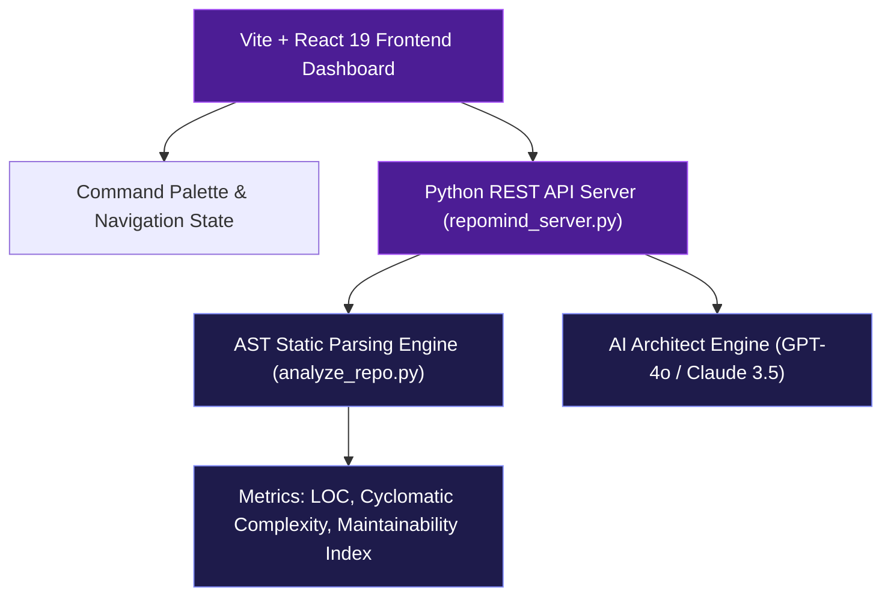

# 🧠 RepoMind AI — Software Repository Intelligence & Technical Debt Analyzer

> **Turn complex codebases into actionable engineering intelligence.**

[](LICENSE.md)
[](https://react.dev/)
[](https://vitejs.dev/)
[](https://tailwindcss.com/)
[](https://docs.python.org/3/library/ast.html)

---

## 📌 Executive Overview

**RepoMind AI** is a modern, production-grade SaaS engineering intelligence platform designed for software engineers, tech leads, engineering managers, and dev teams. It analyzes codebases using **Python AST static parsing**, **dependency topology mapping**, and **AI-powered risk prioritization** to answer five critical questions for engineering teams:

1. **What is wrong** with the codebase?
2. **Why does it matter** (business & technical impact)?
3. **How serious is it** (critical, high, medium, low risk)?
4. **What should the developer fix first** (algorithmic ROI ranking)?
5. **How much effort will it take** (estimated payback hours)?

---

## ✨ Core Features & Platform Modules

```text
Repository ➔ Code Intelligence Engine ➔ AST & Security Scan ➔ Technical Debt Detection ➔ AI Prioritization ➔ Action Plan
```

* 🟣 **Futuristic AI Preloader**: Neural AI Core ring animation with real-time status text telemetry.
* 🏆 **Repository Health Scorecard**: 0-100 stability index broken down across 6 key pillars (*Code Quality, Architecture, Security, Testing, Dependencies, Documentation*).
* ⚠️ **Technical Debt Explorer**: Filterable 147-issue catalog with severity tags, category filters, and effort estimates.
* 🔥 **AI Prioritization Engine**: Algorithmic ranking formula:
  $$\text{ROI Score} = \frac{(\text{Impact} \times 0.35) + (\text{Risk} \times 0.35) + (\text{Frequency} \times 0.15)}{\text{Effort}}$$
* 🏗️ **Architecture Intelligence**: Layer topology graph featuring circular dependency detection (`job_manager ⇄ core_engine`).
* 🕸️ **Dependency Call Graph**: Interactive node network mapping module complexity & maintainability clusters.
* 🔐 **Security Center**: Vulnerability scanner (e.g. command injection checks in subprocess execution patterns) with automated AI fix patch triggers.
* 🤖 **Ask Your Codebase (AI Assistant)**: Senior AI Architect chat interface with prompt chips, typing animations, and code snippet copy blocks.
* 📅 **AI Sprint Planner**: Interactive sprint task board with effort indicators and export to Jira / GitHub Issues.
* 📄 **Executive Report Generator**: Generates exportable PDF, JSON, and Markdown health reports for stakeholders.
* ⌘ **Global Command Palette**: Instant `Ctrl+K` / `⌘K` keyboard search modal.

---

## 🏗️ System Architecture



---

## ⚡ Quickstart & Local Installation

### Prerequisites
* **Node.js**: `>= 18.0.0`
* **Python**: `>= 3.10`

### 1. Clone the Repository
```bash
git clone https://github.com/Abhilanshu/Repo-Mind-Ai.git
cd Repo-Mind-Ai
```

### 2. Install Dependencies
```bash
npm install
```

### 3. Run Development Web Server
```bash
npm run dev
```
Open **[http://localhost:3000](http://localhost:3000)** in your browser.

### 4. Run Production Build
```bash
npm run build
```

### 5. Start Backend REST API Server (Optional)
```bash
python repomind_server.py
```
API endpoints will serve on **[http://localhost:5000](http://localhost:5000)**.

### 6. Run Python AST Static Scanner
```bash
python scratch/analyze_repo.py
```

---

## 👥 Group Project Team Work Distribution (4 Members)

| Team Member | Role | Files Owned | Key Deliverables |
| :--- | :--- | :--- | :--- |
| **Member 1** | **Frontend Architect & UI Lead** | `Preloader.tsx`, `LandingPage.tsx`, `Header.tsx`, `Sidebar.tsx`, `CommandPalette.tsx`, `HealthScoreCard.tsx` | Design system, AI Preloader, responsive layouts & dashboard navigation |
| **Member 2** | **Static Analysis Lead** | `analyze_repo.py`, `CodeQualityView.tsx`, `DependencyGraphView.tsx`, `FileIntelligenceModal.tsx` | Python AST parser, cyclomatic complexity metrics & maintainability index |
| **Member 3** | **Security & Debt Lead** | `SecurityDashboard.tsx`, `TechnicalDebtExplorer.tsx`, `PrioritizationEngine.tsx`, `SprintPlannerView.tsx` | Static vulnerability scanner, ROI prioritization formula & sprint planning |
| **Member 4** | **AI & Backend Lead** | `ArchitectureView.tsx`, `AICodebaseAssistant.tsx`, `ReportGeneratorModal.tsx`, `repomind_server.py` | Architecture topology graph, Senior AI Assistant chat & REST API server |

---

## 📄 License & Credits

Developed by **Abhilanshu Vittolia & Team**.  
Licensed under the [MIT License](LICENSE.md).
